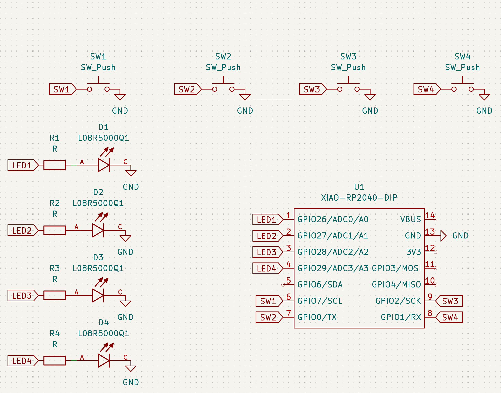
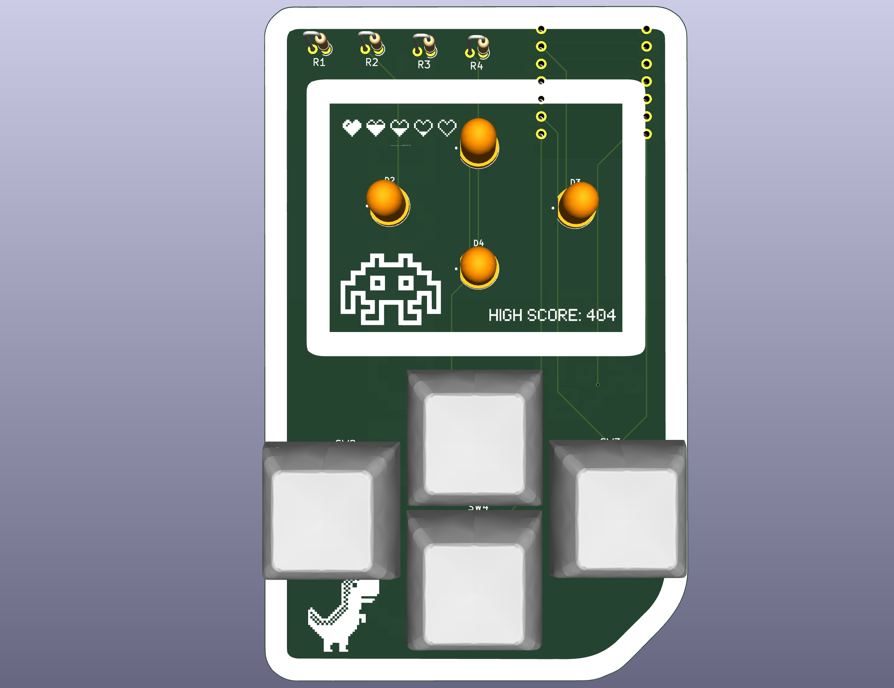
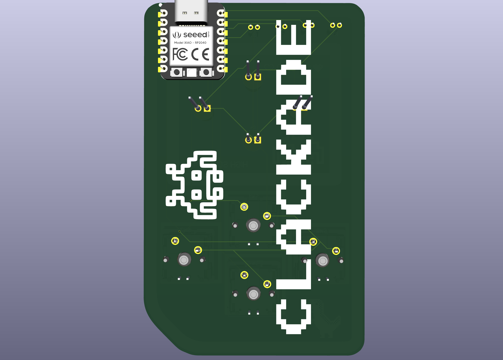

# 🎮 Clackade — LED the games begin!
a mini arcade in a gameboy style look, with 4 games inter-switchable by long-pressing the first button.

---

## Included Games

### 1. **Simon Says**
- **Type:** Memory Game  
- **Goal:** Repeat a randomly growing LED sequence. One wrong move resets the game.

### 2. **Whack-a-LED**
- **Type:** Reflex Game  
- **Goal:** Hit the button matching the LED before time runs out. Speeds up over time. Win animation triggers on a score threshold.

### 3. **LED Chase**
- **Type:** Timing Game  
- **Goal:** Press the button when the LED "chase" passes over it. The pattern loops in direction, and difficulty increases with score.

### 4. **Code Cracker**
- **Type:** Logic Puzzle  
- **Goal:** Guess a secret 3-button code. LEDs indicate correct positions or correct buttons in wrong positions (like a hardware Wordle).

---

## Hardware Views

### Schematic

---

### PCB Layout

---

### 3D View

---

## How It Works

- Microcontroller: Seeed XIAO RP2040  
- Buttons: 4x tactile keyboard keys
- LEDs: 4x single-color  
- Mode Switching: Long press on top button triggers the game select loop

---

## Credits

- Made by [U.N. Owen](https://github.com/pari55051)
- Slack ID:  U08TH3JV9V4 (for hackclub's slack)
- Made for: [Pathfinder - Hackclub's YSWS](http://pathfinder.hackclub.com/)

* the drill and gerber files are in the production folder in folders drill an gerbers respectively
