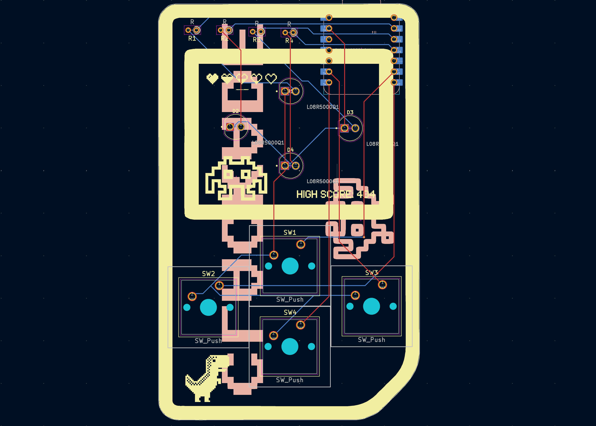

# 🎮 Clackade — LED the games begin!
a mini arcade in a gameboy style look, with 4 games inter-switchable by long-pressing the first button.

---

## Included Games

1. Simon Says: memory game where a sequence is shown and you have to press the exact same one

2. Whack-a-LED: click the corresponding button to the led before the timer runs out (like Whack a Mole)

3. LED Chase: use the D-pad shaped buttons to navigate to the glowing led as fast as possible

4. Code Cracker: try to guess a randomly code like a detective

---

## Images (or screenshots :P)

### Schematic

---

### PCB Layout

---

### 3D View

---

## How It Works (also acts as a BOM)

- Microcontroller: Seeed XIAO RP2040  
- Buttons: 4x tactile keyboard keys
- LEDs: 4x single-color (+ resistors)
- Mode Switching: Long press on top button triggers the game select loop

---

## Credits

- Made by [U.N. Owen](https://github.com/pari55051)
- Slack ID:  U08TH3JV9V4 (for hackclub's slack)
- Made for: [Pathfinder - Hackclub's YSWS](http://pathfinder.hackclub.com/)

> the drill and gerber files are in the production folder in folders drill an gerbers respectively
